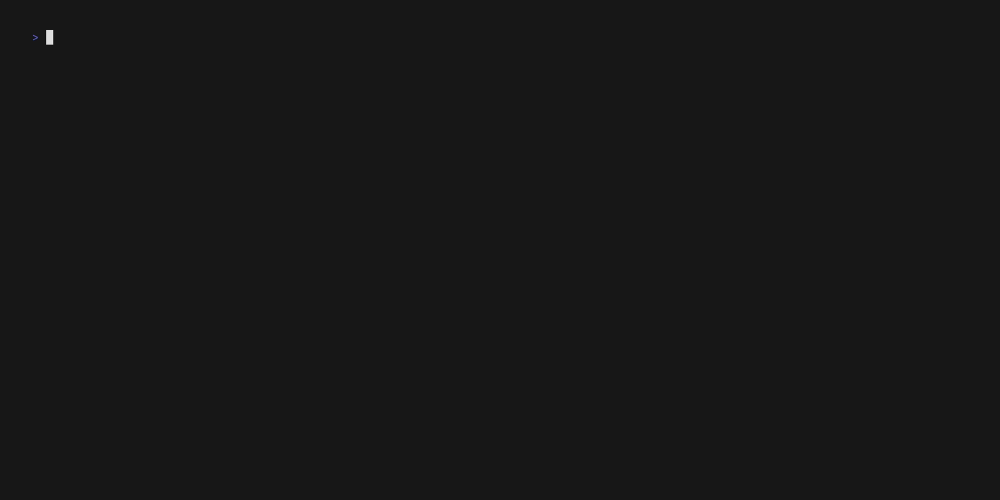

# tf-tui

[](docs/demo.gif)

> [!NOTE]
> The gif is a bit buggy and likely also out of date as its being updated frequently right now.


## Ensure Launch Options

Add the following launch options:
`+con_timestamp 1 -rpt -g15 -usercon +ip 0.0.0.0 +sv_rcon_whitelist_address 127.0.0.1 +rcon_password tf-tui`

## Config File

There is a config editor in the app, however its currently *very* limited and only supports a couple fields. You can
access that with the `shift+e` shortcut.

- Linux: `~/.config/tf-tui/tf-tui.yaml`
- Windows: `%LOCALAPPDATA%\tf-tui\tf-tui.yaml`

```yaml
# Your own steamid
steam_id: "76561197970000000"

# Path to your console.log
console_log_path: /home/<username>/.steam/steam/steamapps/common/Team Fortress 2/tf/console.log

# How often to update the player state tables.
update_freq_ms: 2000

# API URL, dont change unless you are implementing your own API
api_base_url: https://tf-api.roto.lol/

# Use server mode instead of local. In this mode you connect to many remote servers. This is meant for server
# operators to be able to monitor servers similar to HLSW type tools.
# This will transform the display to better fit this mode of operation.
server_mode_enabled: false

# The address that the remote server should send logs to. This must be a routeable ip/host from the server.
server_log_address: 100.10.10.3:27115

# The address that is bound to on the local machine to accept requests on.
server_bind_address: 100.10.10.3:27115

# Set of custom bot detector lists
# Doesn't currently really use the data, but it will eventually.
bd_lists:
  - url: https://raw.githubusercontent.com/PazerOP/tf2_bot_detector/refs/heads/master/staging/cfg/playerlist.official.json
    name: poozer

# Custom URL links to show
# The %s is replaced with the steamid of the format set. Empty defaults to steam64.
# format can be one of: steam64, steam, steam3
links:
  - url: https://demos.tf/profiles/%s
    name: demos.tf
    format: "steam64"

# A list of all known servers that may be used. When running in different modes, the list behaves slightly
# differently.
#
# local: It will pick the first server that has a local address, localhost/127.0.0.1 and ignore all other entries.
# server: It will skip the local server and load *all* of the remaining servers.
servers:
  # Used for your standard "local" mode
  - address: l27.0.0.1:27015
    password: tf-tui
    log_secret:

  # All used for the server mode
  - address: sea-1.us.example.com:27015
    password: aaaaaaaaaa
    log_secret: 111111111
  - address: sea-1.us.example.com:27025
    password: bbbbbbbbbb
    log_secret: 222222222
  - address: sea-1.us.example.com:27035
    password: cccccccccc
    log_secret: 333333333
```

### Overriding Configuration Via Environment & dotenv

Both standard env vars and vars found in `.env` are automatically loaded. They are only considered valid if they
contain the `TFAPI_` prefix. The values are otherwise the same as they are in the config file.

```bash
TFAPI_UPDATE_FREQ_MS=1000 tf-tui
```

## Server Mode

Server mode is a alternate running mode in which instead of connecting to your local game client, you connect
to a srcds instance for remote monitoring. This works the same way as tools like HLSW.

## Debug Log

If you set `DEBUG=1` env var, a log file will be created for extra error logging & debug messages.

Linux: `~/.config/tf-tui/tf-tui.log`

Tail shortcut: `make tail`

## Building

The only build dependency is `go1.24+`.

Full snapshot build using goreleaser. Binaries are output to the platform specific paths: `./dist/tf-tui_{linux,windows}/tf-tui`:

```sh
$ make snapshot
```

The standard go build options will also work, but some values will not be automatically injected into the build such as version/commit info.

```sh
$ go build -o tf-tui cmd/tf-tui/* && ./tf-tui
```

### Releases

Releases are built and uploaded automatically when a new matching tag is pushed.

```sh
$ git tag -a v1.2.3 -m "v1.2.3 release!" && git push --tags
```
